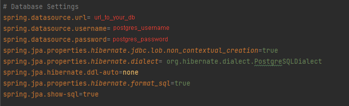
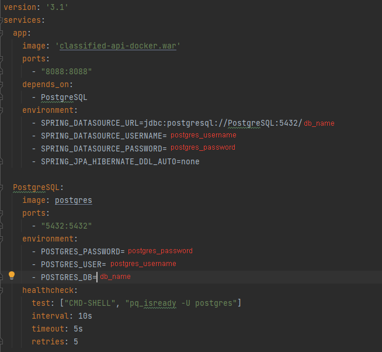

<h1>Documentation</h1>

<h2>Before you start</h2>

Required tools & technologies to run the application:
1. Docker. See https://docs.docker.com/get-docker/
2. PostgreSQL. See https://www.postgresql.org/download/
3. Java Development Kit (JDK). See https://www.oracle.com/java/technologies/downloads/
4. Apache Maven. See https://maven.apache.org/download.cgi

<h2>Get the App</h2>

```
git clone https://git-students.senla.eu/Kaluga-java-intern_VlasNagibin/vlas_nagibin_dyploma.git
```

<h2>Configure by Yourself</h2>

```
src/main/resources/application.properties
```



```
classifiedapi/docker-compose.yml
```



<h2>Build the App</h2>

```
mvn clean
```

```
mvn package
```

<h2>Run the App</h2>

```
docker build -t classified-api-docker.war .
```

```
docker-compose up -d
```

<h2>Stop the App</h2>

```
docker-compose down
```
